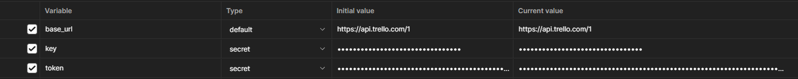
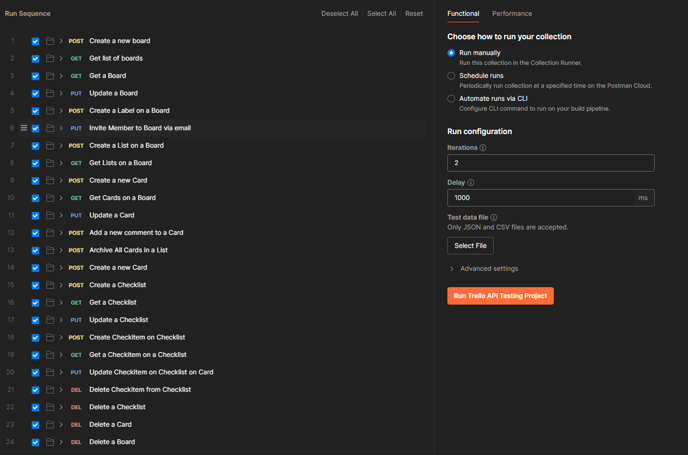

# 📌 Trello API Testing Project

This project showcases **practical API testing skills** using **Postman** with Trello’s RESTful API. The test flow simulates a basic task management scenario involving the creation and manipulation of boards, lists, cards, labels, and checklists.

## ✅ Key Features Tested

- ✅ Creating, updating, retrieving, and deleting boards (`POST`, `PUT`, `GET`, `DELETE`)
- 📋 Managing lists and cards
- 🏷️ Adding and verifying labels
- ✔️ Handling checklists and check items
- 🧪 Asserting response status codes, data types, response times, and data integrity

The tests use **collection and environment variables**, **pre-request scripts**, and **dynamic JavaScript assertions** to ensure robust and maintainable API validation.

---

## 🚀 How to Use This Project

Follow these steps to get started with the Trello API Testing project in Postman:

1. ✏️ Create a free Trello account at [trello.com](https://trello.com)
2. 🔑 Log in and generate your personal API key and token from the [Trello Developer API Key page](https://trello.com/app-key)
3. 📂 Clone this repository or download the ZIP file and extract it
4. 🔄 Import the collection ([postman_collection](./Trello%20API%20Testing%20%20Project.postman_collection.json)) into Postman
5. ⚙️ Set up your environment variables:
   - `base_url`: `https://api.trello.com/1`
   - `key`: _your Trello API key_
   - `token`: _your Trello API token_
   
6. 📤 Send requests:
   - Make sure the Trello environment is selected
   - Run the requests in order (e.g., **Create Board** → **Create List** → **Create Card**, etc.)
   - Some variables (like `board_id`) are automatically saved after requests
7. ✅ Run tests:
   - Each request includes built-in tests (check the **Tests** tab in Postman)
   - After sending a request, scroll down to the **Test Results** section  
     ✅ = pass, ❌ = fail
8. 🧪 Optional: Use the **Postman Collection Runner**
   - Click the **Run** button in Postman
   - Configure the number of iterations or add a delay
   - Click **Run Trello API Testing Project** to execute the full test suite automatically
    
9. ⏰ You can also create a **Monitor** to automatically run the collection at scheduled intervals  
   This allows you to continuously verify API health and catch regressions early.
